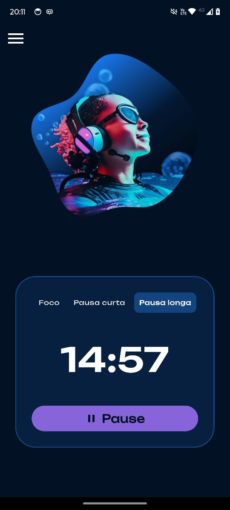
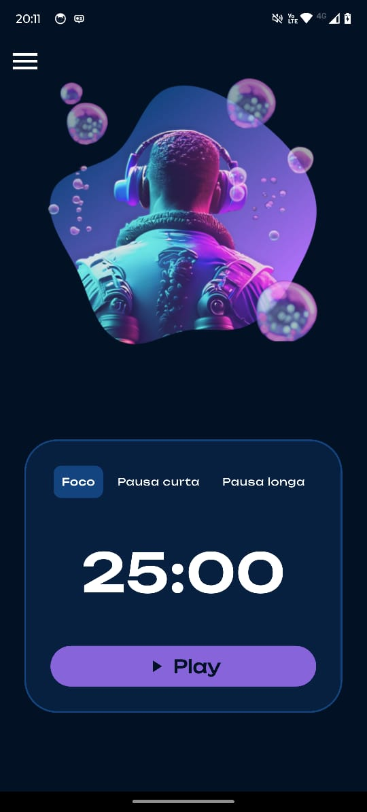

# 🧠 Timer - Temporizador de Produtividade

**Timer** é um aplicativo de temporizador baseado na técnica Pomodoro, com uma interface moderna e imersiva. Desenvolvido com **Flutter**, ele te ajuda a otimizar seu tempo com ciclos de foco e pausas personalizadas.





---

## ✨ Funcionalidades

- ⏱ **Temporizador Pomodoro** com 3 modos:
  - Foco (25 minutos)
  - Pausa curta (5 minutos)
  - Pausa longa (15 minutos)
- 🎨 Interface com visual futurista e animações suaves
- 🎧 Personagens e imagens inspiradoras para motivar o usuário
- 🎵 Botão Play / Pause com estados dinâmicos
- 🔁 Transições animadas entre telas (Hero, Fade, Scale)

---

## 📱 Tecnologias utilizadas

- **Flutter** (Dart)
- `Timer` para controle do tempo
- `PageRouteBuilder` com animações personalizadas
- `Hero` widget para transições suaves de imagens
- `Google Fonts` e design responsivo

---

## 🧪 Como rodar o app

1. Clone o repositório:

```bash
git clone https://github.com/mateusheberle/timer.git
cd timer
```

2. Instale as dependências:

```bash
flutter pub get
```

3. Rode o app:

```bash
flutter run
```

---

## 📂 Estrutura do projeto

```
lib/
├── main.dart
├── screens/
│   ├── splash_screen.dart
│   ├── timer_screen.dart
├── widgets/
│   ├── timer_card.dart
│   ├── mode_selector.dart
assets/
└── images/
    ├── foco.jpeg
    ├── pausa_curta.jpeg
    ├── pausa_longa.jpeg
```

---

## 💡 Inspiração

Este app foi inspirado por ferramentas como **Forest**, **Focus To-Do** e o conceito de **imersão no foco**.

> “Mergulhe no que importa.”

---


## 📃 Licença

Este projeto é de código aberto sob a licença MIT. Veja o arquivo [LICENSE](LICENSE) para mais detalhes.

---

## 👨‍💻 Autor

Desenvolvido por **Mateus Auler Heberle**  
🌍 Itapema - SC | 🇧🇷  
